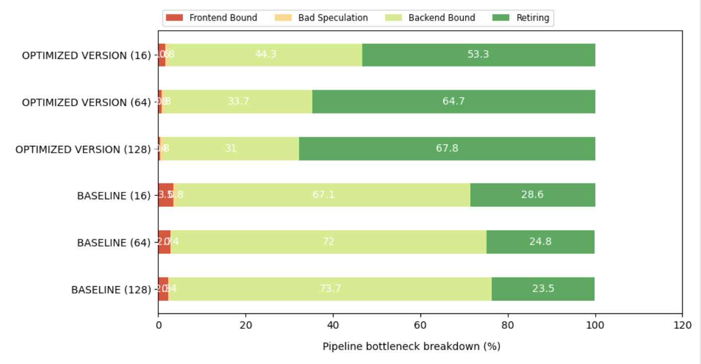

# GPT-2 Model Optimization Report

## **Top-down Analysis**

## **Performance Data (Runtime)**

| Model | Optimized Model | Baseline |
|--------------------------|--------------------------------|----------------------------------|
Input Size (Tokens) | 16                       | 16                        |
Average Runtime (seconds)| 0.2660                       | 4.0579  
                     
| Model | Optimized | Baseline |
|--------------------------|--------------------------------|----------------------------------|
Input Size (Tokens) | 64                       | 64                        |
Average Runtime (seconds)| 1.5414                       | 16.0655                       |

| Model | Optimized | Baseline |
|--------------------------|--------------------------------|----------------------------------|
Input Size (Tokens) | 128                       | 128                        |
Average Runtime (seconds)| 3.0592                       | 32.5403                       |

## **Optimization Techniques**

In the profiling data, there is a high **backend bound** across different input sizes, indicating that the performance of the program is limited by the processor's ability to move data and complete computations. So I used SIMD to reduce the overhead of instruction execution, multithreading to utilize more available cores for concurrent computations, and blocking to mitigate memory latency and bandwidth limitations, making memory accesses more efficient.

---

### **1. SIMD**
I used SIMD (Single Instruction Multiple Data) intrinsics - vectorized operations to perform multiple computations in parallel. For instance, instead of performing element-wise operations in a loop, specialized SIMD instructions can process 4 or 8 elements simultaneously using vector registers (`__m128` for 4 floats in SSE or `__m256` for 8 floats in AVX).
I refactored codes in `linear`, `scaled_dot_product_attention`, `matrix_add`, `gelu` with SIMD intrinsics. For example in `scaled_dot_product_attention`, instead of a scalar dot product, I load 4 consecutive elements from `Q` and `K` into SIMD registers, multiply them, and accumulate the results into a vector register. The accumulated result is then scaled and stored back in memory.
This reduces the number of instructions executed by the CPU, speeds up linear algebra computations, and improves the performance of the attention mechanism.

---

### **2. Multithreading**
I used `OpenMP` to divide the work among threads to compute attention for different queries (`Q`) concurrently. Each thread independently computes the attention scores for one or more rows of the output matrix. This reduced the computation time through parallelization.

---

### **3. Blocking / Tiling**
As observed from the profiling data, there’s a high backend bound. Large matrices often don't fit entirely in the CPU's cache, causing frequent cache misses and slowdowns. To address this issue, I used blocking, which breaks computations into smaller submatrices (blocks) that fit within the CPU's cache. During the computation, only blocks of data are loaded into cache and reused until their computation is complete, minimizing memory bandwidth usage and cache misses.
